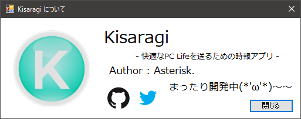

# Kisaragi
Kisaragi is TimeSignal Application for .NET

## Kisaragi is 何？
作業に没頭する人向けの、時間お知らせサポートアプリですっっ('ω')  
今のところ、1時間毎に通知を出してくれるようです。  

2018-03-13 時点：  
- タスクトレイ機能に対応中 => 完了
- UML 図のコミット完了(今後、適宜修正が入ります。) => 実施中  

2018-03-15 時点：  
- Twitter へ投稿するために、投稿ライブラリを作成しました。まだコミットしてません。
- version 1.0 リリースに向けて、絶賛リファクタリング中。  

2018-03-21 時点： 
- OAuth1.0a 及び 2.0 に対応するべく、全体的な アクセスAPI を構築中。
　認証は Pass したが、 GET, POST の投稿で Failed している状況。

## License for Kisaragi
MIT License

## 使用した OS, IDE など
- OS
  - Windows 10 Home

- IDE
  - Visual Studio 2017 Community (.NET Framework 4.6.1)
  - Visual Studio Code 1.12
  - SmartGit
  
### Kisaragiで利用しているライブラリとそのライセンス
- Newtonsoft.Json : MIT License
- JsonFx : MIT License
