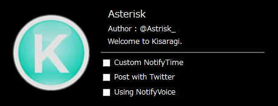
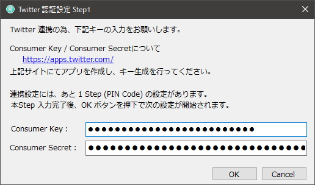
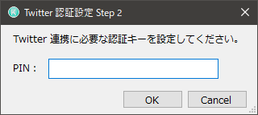

# Kisaragi
Kisaragi is TimeSignal Application for .NET

## Kisaragi is 何？
作業に没頭する人向けの、時間お知らせサポートアプリ('ω')  

## 主な機能
- 1時間毎の通知：24h
- アラーム機能：任意の時間にて設定できます。設定単位：分
- Twitter 連携機能：ライブラリ：自作, 通知メッセージを投稿
- ボイス機能：音声ファイルを使用することにより、通知をより分かりやすくできます。
- タスクトレイ常駐：設定、バージョン情報、終了はここから行います。

## 使い方
- Kisaragi を [v1.0.0](https://github.com/Asteriskx/Kisaragi/releases/tag/v1.0.0 "v.1.0.0") より、DL します。  
  もしくは、`Download ZIP`より　`Clone` します。  
  個人の環境に合わせて `Clone` する場所は決めてください。  
  
- `DL` または `Clone` した Kisaragi を解凍し、`Kisaragi.sln` を開いてください。  
  Kisaragi の動作環境は `.NET Framework 4.7.1` が動作する環境が必須となります。  
  `Visual Studio 2017` をインストールすることで解決すると思います。 

#### メイン画面  

- [x] Custom NotifyTime  
  アラーム機能有効時、通知発生までの時間を設定します。  
  `タスクトレイ：Settings` より、時間の設定が可能です。  
  
- [x] Post with Twitter  
  `Twitter` と連携する際に使用します。  
  連携設定に関しては、以下設定画面を参照してください。
  
- [x] Using NotifyVoice  
  通知をボイス付きで行いたい時に使用します。  
  現状の音声ファイルの種類は `26` 種類あります。  
  拡張子は `.mp3` を使用します。  
  
##### 音声ファイルは、各個人にて用意してください。 
##### 再生される音声が大きい場合がありますので、音量調節をお願いします。  

  | file name | content |  
  | ---- | ---- |  
  | 0 ～ 23 | 0時～24時の時報に対応する音声ファイル。|  
  | 24 | Kisaragi が終了する際の音声ファイル。 |  
  | 25 | アラーム機能にて使用する音声ファイル。 |  
  
#### Consumer Key / Secret の設定画面  

#### Twitter アプリ連携にて取得した PIN Code の設定画面  

## 不具合に関して  
- お手数おかけしますが、以下に連絡をお願い致します。  
  使用日時、使用環境、不具合が出るまでの手順を伝えて頂けると幸いです。  
  
GitHub : [GitHub](https://github.com/Asteriskx/Kisaragi/issues "GitHub")  
Twitter: [Twitter](https://twitter.com/Astrisk_ "Twitter")  

## History
2018-03-13 時点：  
- タスクトレイ機能に対応中 => 完了
- UML 図のコミット完了(今後、適宜修正が入ります。) => 実施中  

2018-03-15 時点：  
- Twitter へ投稿するために、投稿ライブラリを作成しました。まだコミットしてません。
- version 1.0 リリースに向けて、絶賛リファクタリング中。  

2018-03-21 時点： 
- OAuth1.0a 及び 2.0 に対応するべく、全体的な アクセスAPI を構築中。
　認証は Pass したが、 GET, POST の投稿で Failed している状況。

2018-04-23 時点： 
- Ver1.0 リリースに向けて最終調整中。  
  Usage 等に関しても記載していきます。  
  もうしばらくお待ちください。
  
2018-05-03 時点：
- 全体的な機能見直しを実施  
  - アラーム機能を追加  
  - 音声ファイルがなくても、アプリ動作が可能に  
  - Twitter 連携時の認証キーを GUI 上から入力可能に  
  
- 使用方法を記載中。
- v.1.0.0 リリース。
 
## License for Kisaragi
MIT License

## 使用した OS, IDE など
- OS
  - Windows 10 Home

- IDE  
  - Visual Studio 2017 Community (C# 7.1, .NET Framework 4.7.1)
  - Visual Studio Code 1.12
  - SmartGit
  
### Kisaragiで利用しているライブラリとそのライセンス
- Newtonsoft.Json : MIT License
- JsonFx : MIT License
